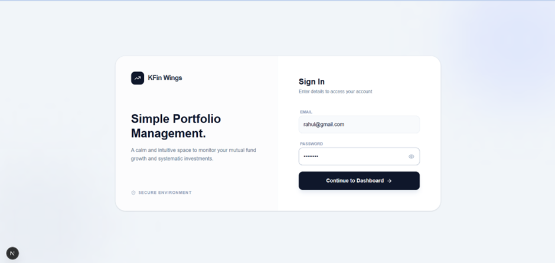
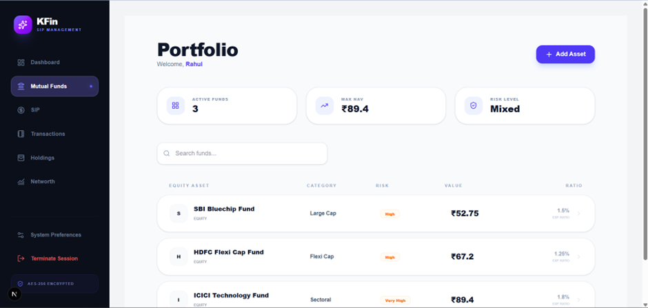
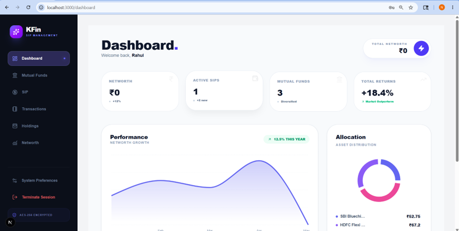
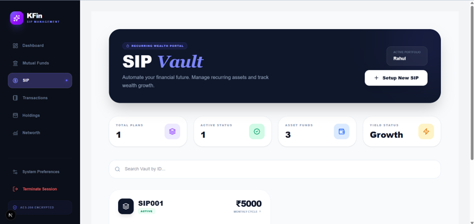
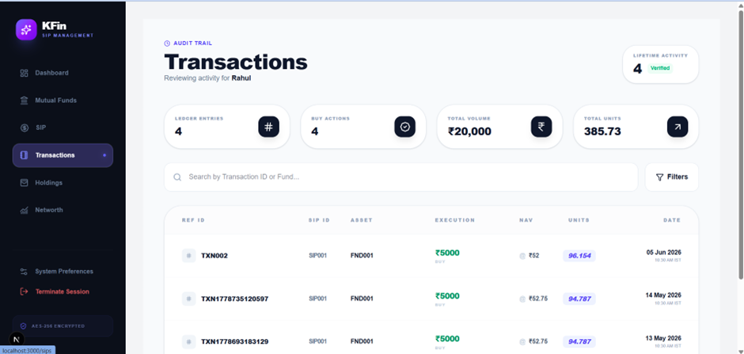
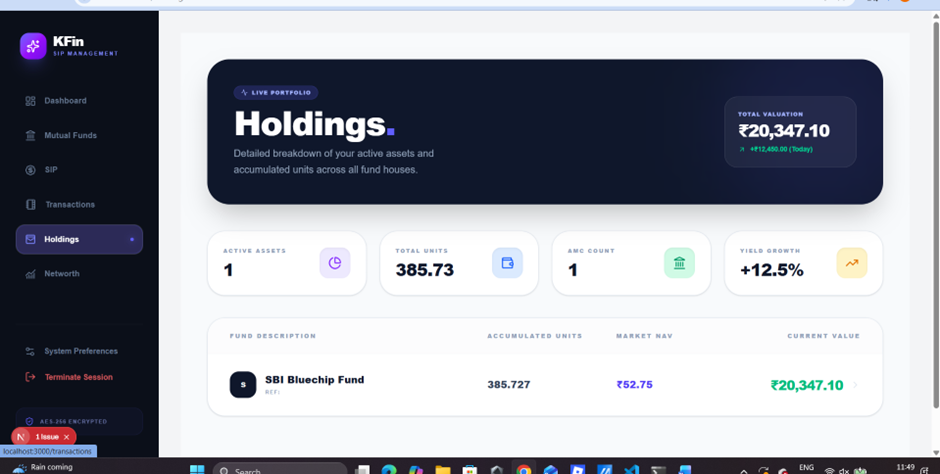
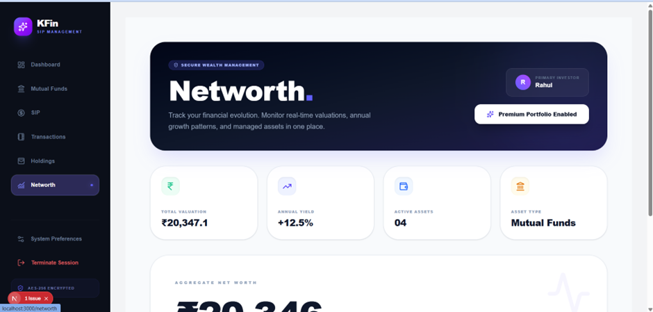

# 🚀 Mentor Session Frontend

A modern and responsive frontend application developed using **Next.js** and **React.js** for managing investors, funds, SIPs, holdings, transactions, and portfolio analytics.

---

# 📌 Features

✅ Authentication System  
✅ Dashboard Analytics  
✅ Investor Management  
✅ Fund Management  
✅ SIP Tracking  
✅ Holdings Management  
✅ Transactions Monitoring  
✅ Net Worth Analysis  
✅ Responsive UI Design  
✅ Clean Component Architecture  

---

# 🛠️ Tech Stack

| Technology | Usage |
|------------|-------|
| Next.js | Frontend Framework |
| React.js | UI Development |
| JavaScript | Application Logic |
| Tailwind CSS | Styling |
| REST APIs | Backend Communication |

---

# 📂 Project Structure

```bash
app/
│
├── (auth)/
├── (main)/
├── components/
├── context/
├── services/
├── screenshots/
│   ├── i1.png
│   ├── i2.png
│   ├── i3.png
│   ├── i4.png
│   ├── i5.png
│   ├── i6.png
│   └── i7.png
│
public/
middleware.js
package.json
```

---

# ⚙️ Installation & Setup

## 1️⃣ Clone Repository

```bash
git clone https://github.com/2200031825/frontend.git
```

---

## 2️⃣ Navigate to Project Folder

```bash
cd frontend
```

---

## 3️⃣ Install Dependencies

```bash
npm install
```

---

## 4️⃣ Run Development Server

```bash
npm run dev
```

---

# 🌐 Application URL

```bash
http://localhost:3000
```

---

# 📷 Project Screenshots

## 🔐 Login Page



---

## 📊 Dashboard



---

## 👥 Investors Management



---

## 💰 Funds Management



---

## 📈 Holdings Page



---

## 💳 Transactions Page



---

## 📉 Net Worth Analytics



---

# 🔥 Key Modules

### 🔹 Authentication
- Secure login system
- Protected routes

### 🔹 Dashboard
- Analytics overview
- Quick statistics

### 🔹 Investors
- Investor information management
- Dynamic data handling

### 🔹 Funds
- Fund tracking
- Fund performance overview

### 🔹 SIPs
- SIP monitoring
- Investment tracking

### 🔹 Holdings
- Portfolio holdings management

### 🔹 Transactions
- Transaction history
- Financial records

### 🔹 Net Worth
- Portfolio valuation
- Wealth analytics

---

# 📦 Build Project

```bash
npm run build
```

---

# 🚀 Deployment

Recommended platforms:

- Vercel
- Netlify
- AWS Amplify

---

# 👨‍💻 Author

## Nithish Kumar

Frontend Developer | Next.js Developer

---

# ⭐ GitHub Repository

https://github.com/2200031825/frontend

---
